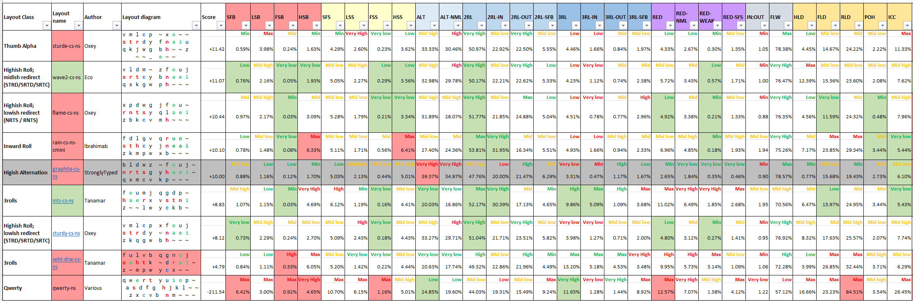
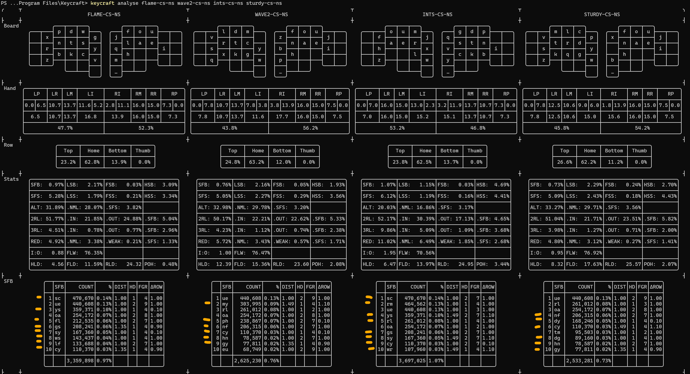
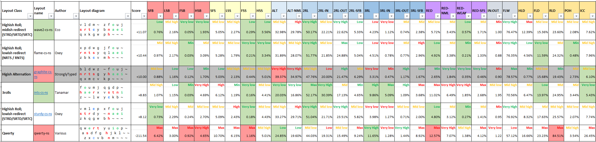
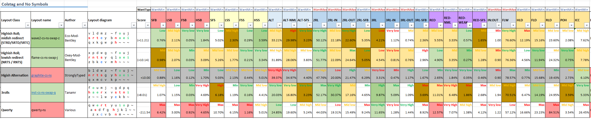
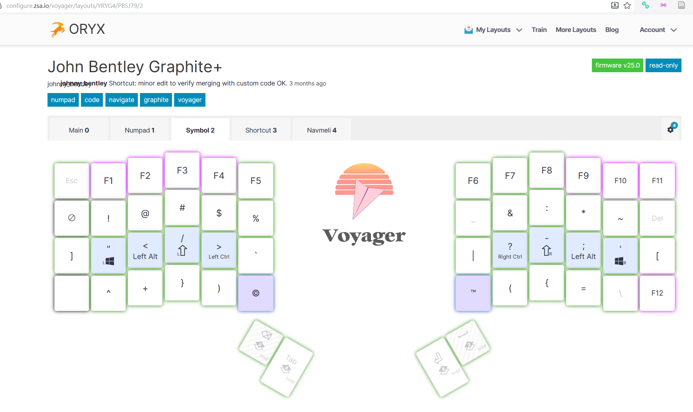
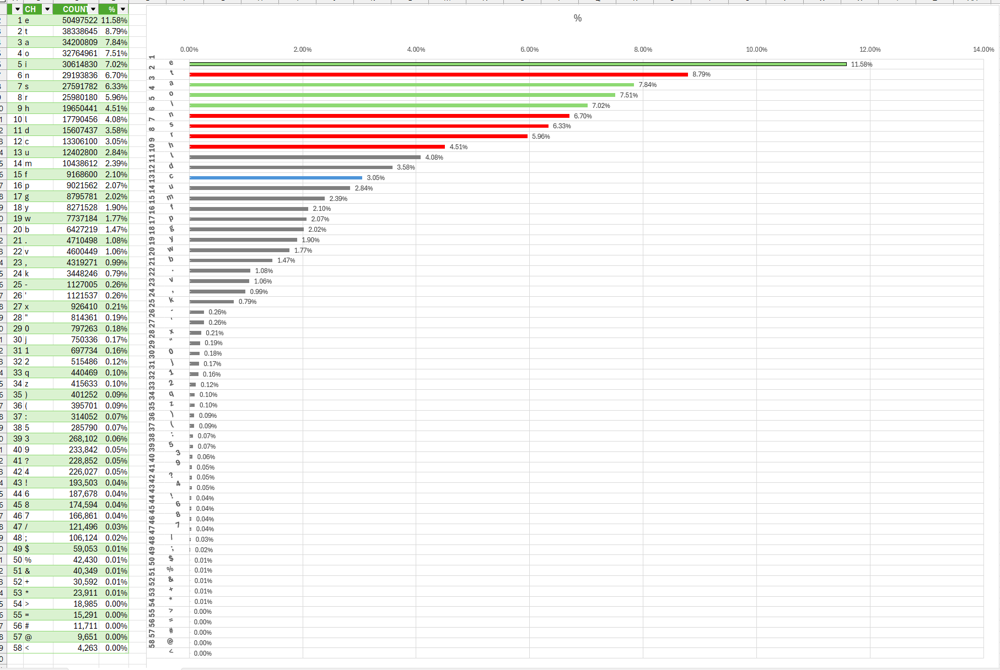
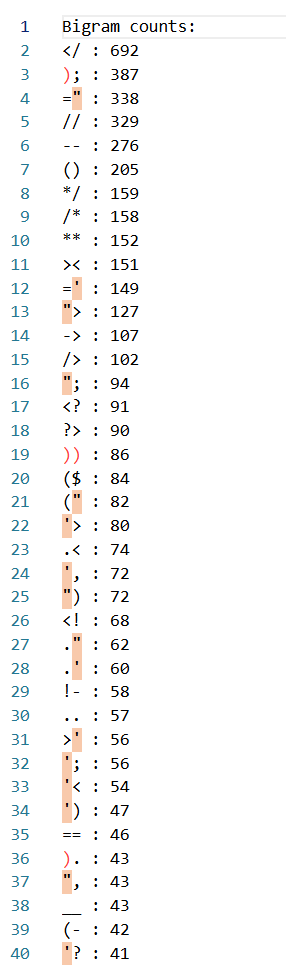

# Best keyboard layouts that are midish-to-lowish alternating, highish roll, and matching other idiosyncratic criteria

Under construction @ 2026-02-22 10:40  ...

## Table of contents

* [Table of contents](#table-of-contents)
* [Summary](#summary)
* [Intro](#intro)
* [Hardware (and software)](#hardware-and-software)
* [Criteria](#criteria)
* [Context](#context)
* [Analysis](#analysis)
  * [Overview](#overview)
  * [The candidate layouts](#the-candidate-layouts)
  * [Ways of speaking](#ways-of-speaking)
  * [Layout key](#layout-key)
  * [Keycraft customisation](#keycraft-customisation)
    * [Layout customisation](#layout-customisation)
    * [Weights file customisation](#weights-file-customisation)
    * [Corpus](#corpus)
  * [The stats](#the-stats)
  * [Reading the stats](#reading-the-stats)
  * [Elimination round 1 - Qwerty](#elimination-round-1---qwerty)
    * [Qwerty is shit](#qwerty-is-shit)
    * [... but not all shit](#-but-not-all-shit)
  * [Elimination round 2 - eliminating highish alternation layouts](#elimination-round-2---eliminating-highish-alternation-layouts)
  * [Elimination round 3 - eliminating layouts for ad hoc reasons](#elimination-round-3---eliminating-layouts-for-ad-hoc-reasons)
  * [Winner round 1 - ints-cs-ns](#winner-round-1---ints-cs-ns)
  * [Elimination round 4 - the battle of the highish roll; lowish redirect layouts - flame-cs-ns V sturdy-cs-ns](#elimination-round-4---the-battle-of-the-highish-roll-lowish-redirect-layouts---flame-cs-ns-v-sturdy-cs-ns)
  * [Elimination round 5 - wave2-cs-ns V flame-cs-ns](#elimination-round-5---wave2-cs-ns-v-flame-cs-ns)
    * [Issue 1: SFB index concentration](#issue-1-sfb-index-concentration)
    * [Issue 2: the trigram "str"](#issue-2-the-trigram-str)
    * [Issue 3: general metrics advantage](#issue-3-general-metrics-advantage)
    * [Modifying the layouts](#modifying-the-layouts)
  * [Can ints-cs-ns be improved?](#can-ints-cs-ns-be-improved)
* [Wrapping up](#wrapping-up)
  * [Review](#review)
  * [Symbols layer](#symbols-layer)
  * [Final Result](#final-result)

## Summary

What are the best keyboard layouts that are midish-to-lowish alternating, highish roll, and matching other idiosyncratic criteria?

I'm answering this on the basis of analysis largely using ...

* @ironcollar's analyser [keycraft](https://github.com/rbscholtus/keycraft); and
* Using some concepts and info from @ec0's [Keyboard layouts doc (3rd edition)](https://docs.google.com/document/d/1W0jhfqJI2ueJ2FNseR4YAFpNfsUM-_FlREHbpNGmC2o/edit?usp=sharing) (KLD).

... both excellent pieces of work.

The aim is to select some winners to do a practical trial on.

I'm on a colstag programmable [ZSA Voyager](https://www.zsa.io/voyager) keyboard. Coming from a lifetime of qwerty, I've recently learnt graphite to 20wpm. But I find graphite unsatisfying. Hence the search for the right layouts to trial.

In the layout diagrams, following keycraft conventions, `~` means no key, not the tilde key. It could be assigned to any symbol or command; or left unused.

On my analysis, and using the criteria (yet to be detailed), the winning layouts, in to-trial order, are:

**ints-cs-jbs-swap-q**. Based on [ints by Tanamr](https://github.com/samuelxyz/layouts#ints) (a "3rolls" layout), but un-angle modded, colstag, John Bentley symbols, with a swap (q).

```text
f o u m j  ~ g d p q
h a e r x  v s t n i
z . , l w  y c k b ~
```

**flame-cs-jbs-swap-j**. Based on [flame by Oxey](https://github.com/rbscholtus/keycraft/blob/main/data/layouts/flame.klf) (a "Highish Roll; lowish redirect (NRTS / RNTS)" layout), but un-angle modded, colstag, John Bentley symbols, with a swap (j).

```text
x p d w g  ~ f o u j
r n t s y  q l a e i
z b k c v  m h , . ~
```

There are three places where flame is defined which I'll refer to (for this section only) as: flame-keycraft, flame-cmini, and flame-kld. These essentially resolve to two variants:

* [flame-keycraft](https://github.com/rbscholtus/keycraft/blob/main/data/layouts/flame.klf) and [flame-cmini](https://discord.com/channels/807843650717483049/1063291226243207268/1473851644927279124) - cmini is a Alt Keyboard Layouts (AKL) analyser app for calling up an overview of stats in discord posts - are consistent with each other;
* [flame-kld](https://docs.google.com/document/d/1W0jhfqJI2ueJ2FNseR4YAFpNfsUM-_FlREHbpNGmC2o/edit?tab=t.vb3u6rdlmxg1#heading=h.32kya2qv9d0) - flame as presented in KLD - differs from both in having `q` and `j` swapped. Presumably, flame-kld is an earlier version from which flame-keycraft/flame-cmini evolved. 

I'm using flame-keycraft as my "original" version from which I derive variants.

The runner up, a backup to trial if the above don't click, is:

**wave2-cs-jbs-swap-z**. Based on [wave2 by ec0](https://docs.google.com/document/d/1W0jhfqJI2ueJ2FNseR4YAFpNfsUM-_FlREHbpNGmC2o/edit?tab=t.vb3u6rdlmxg1#heading=h.9ms661dgth73) (a "Highish Roll; midish redirect (STRD/SRTD/SRTC)" layout), but un-angle modded, colstag, John Bentley symbols, with a swap (z).

```text
v l d m z  ~ f o u j
s r t c y  b n a e i
q x k g w  p h , . ~
```

I have chosen these layouts having mind they'll work with a symbols layer of mine - [ZSA > Voyager > Oryx > John Bentley Graphite+ > Symbols Layer](https://configure.zsa.io/voyager/layouts/YRYG4/PB5J79/2) (stable link), built for:

* General English - prose, essays, etc. - particularly for the most frequent symbols after `.` and `,`: `-'":?!/;`; and
* The following programming (or "markup", or "style", or "scripting") languages: (x)html, xml, css, javascript, typescript, java, kotlin, powershell, and php.

I'm fairly happy with that symbols layer although it is subject to further tweaking, along with the symbols I'll have on the main layer. However, I think it likely on the main layer `.` and `,` will remain where they are (with respect to the layouts above).

For a table of the above layouts, and their derivation from "original" layouts, see my section "Wrapping up" > [Final Result](#final-result).

I evaluated 14 candidate layouts, and variants of a few of those. Those candidate layouts largely came from suggestions made at [Alt Keyboard Layouts](https://discord.com/channels/807843650717483049/823046923523063818) (AKL, a Discord Server) > questions > [Regard for inrolly2](https://discord.com/channels/807843650717483049/1439184823615885332/1439184823615885332)  with feedback from the following (in participation order): @novachromatic (nova (real name zak)) , @ec0vid (ec0), @iSa, @zak.7 (zahp) , @clickforvictory (NUMBER ONE AKLESBIAN) , @ironcollar ,@bhulik.

## Intro

Identifying a couple of layouts to trial is part of trying to move away from a traditional row staggered qwerty keyboard, which is infamously awful to type on for historical reasons, to find a hardware, software, and layout solution to make typing feel smooth and joyful. Smooth and joyful above even speed improvements. While a more optimal hardware and software solution is likely to make one, with practice, type faster; the goal of "smooth and joyful" is primary.

## Hardware (and software)

On the hardware (and software) side I've settled on a [ZSA Voyager](https://www.zsa.io/voyager), a (split) programmable custom keyboard that has several features, some commendably "opinionated", that make it worth the purchase (I'm not affiliated with ZSA):

* The keycaps are swappable.
* The key-switches are (hot) swappable.
* You can program multiple layers.
* You can program multiple layers through:
  * An easy to use GUI called [Oryx](https://configure.zsa.io/voyager/layouts/YRYG4/latest/0); or
  * Directly customize the underlying (open source) QMK firmware where Oryx is limited; or
  * Most powerfully, use both and merge the result. See [Using a DIY tool to add custom QMK features to your Oryx layout](https://blog.zsa.io/oryx-custom-qmk-features/) (2024-11-07) by Pierre Poulain.
* The keycaps have shine-through programmable RGB lighting.
* It comes with desktop software, "[keymap](https://www.zsa.io/flash#flash-keymapp)", to display your keys and layers.
* It has 52 keys, more than many other programmable custom keyboards, that often go for fewer keys at 42 or 36 keys. As with the [Corne 42 LP](https://keebmaker.com/products/corne-low-profile?variant=47647202410795) or the [Corne 36 LP](https://keebmaker.com/products/corne-36-lp-keyboard). (An opinionated feature).
* It has four thumb keys rather than six thumb keys. Having, and designing for, only four thumb keys seems like the right design choice to make using one's thumbs simpler. (An opinionated feature).
* The keys are low profile. My personal preference. (An opinionated feature).

There are more radical recent keyboard designs that are worth consideration. See for example Ben Vallack's demo of the Svalboard @ [I Tried the World's MOST COMFORTABLE Keyboard](https://www.youtube.com/watch?v=-Lz_FNoYHNM). But from among the less radical programmable keyboards, the flat keyboards, I commend the Voyager.

The rest of the article will focus on the issue of which main layer (a "layout") to use on a flat keyboard.

## Criteria

So we are after a layout that is midish-to-lowish alternating, highish roll, and matches other idiosyncratic criteria.

The other idiosyncratic criteria include:

* **Colstag** (column staggered) layout. As colstag is an ergonomic improvement on rowstag.
* Excluding **thumb alpha layouts**. To keep the thumb keys for other things like backspace, tab, enter, space. As we'll later see with regard to sturde (a derivation of sturdy with a thumb alpha key) these layouts can be well optimised across many metrics. However, as a personal preference, I'll avoid a thumb alpha layout.
* Must have **bottom row symbol slots** on at least ring and middle fingers. Because I'm set in my qwerty ways for `.` and `,` and so want these on my main layer (although they could be on the left hand).
  
* Optimising the (main) layer for **general English**.

  I'm wanting to optimise my *keyboard* for typing both general English (prose, essays, etc.) and programming. The ideal corpus of words (excluding symbols) in programming will be different from ideal corpus of words (excluding symbols) in general English. For example, the keyword "String" is going to appear more frequently in programming. However, the main speed and smoothness impediment in programming are the symbol keys. I'll be taking care of symbols largely with a separate symbols layer; with some high frequency general English symbols on the main layer (`.` and `,`). And so, for the main layer (what this article is about) I'll:

  - Optimize for general English words over programming words; and
  - In my analysis I'll remove symbols from the candidate layouts. Allowing that one's preferred symbols can be inserted in after analysis. And treating symbols optimisation as a separate consideration.


* No **magic key**. A magic key is a worthy innovation by Ikcelaks, "a key that dynamically adjusts its output based on the most recent previous keycode." ([https://github.com/Ikcelaks/keyboard_layouts](https://github.com/Ikcelaks/keyboard_layouts)). However, I'll avoid a magic key as this would make the layout advanced (for me).
* No **repeat key**. As I don't think I'd prefer this over just tapping the relevant key twice; and/or this might be an advanced (for me).
* Consistent with the above otherwise trying to find the layouts that score best on **the metrics overall**. Noting if you optimize for one metric that can penalize one or more other metrics.

## Context

This is a follow up post to my [Regard for inrolly2](https://discord.com/channels/807843650717483049/1439184823615885332/1439184823615885332) which turned into a thread with good feedback on good alternative layouts in general.

I'll repeat my situation as I mentioned it there (with a different emphasis and some addition here):

* I'm a new alternative layout user.
* I've learnt Graphite to about 20wpm on my ZSA Voyager.
* I've read @ec0's [Keyboard layouts doc (3rd edition)](https://docs.google.com/document/d/1W0jhfqJI2ueJ2FNseR4YAFpNfsUM-_FlREHbpNGmC2o/edit?tab=t.2ztid8v3jw2i) (KLD), a distillation of the wisdom of the *Alt Keyboard Layouts* (AKL) community.
* I've skimmed [https://layouts.wiki/](https://layouts.wiki/). In particular, [https://layouts.wiki/guides/start/recommendations/](https://layouts.wiki/guides/start/recommendations/)
* I had come to suspect I dislike highish alternation and like high rolls, especially 3rolls. Things that graphite lacks. That suspicion has been deepened from my analysis.

## Analysis

### Overview

"My analysis" here means:

1. Taking a list of candidate layouts (see the next section), and variants, to evaluate. Largely those flagged by anyone in "Regard for inrolly2" as worthy. This came to 14 layouts (plus variants). In addition I keep around graphite and qwerty as reference layouts.
2. My use of @ironcollar's excellent analyser [keycraft](https://github.com/rbscholtus/keycraft);
3. Dumping data from keycraft into Excel and applying @ec0's ranking levels for each metric (more about that in the section below, [Analysis - ways of speaking](#ways-of-speaking)).
4. Bringing to bear insights from the KLD; and
5. Bringing to bear insights from AKL members in "Regard for inrolly2".

(4) and (5) have been useful to identify either:

* Patterns that aren't revealed in, or aren't obvious in, the keycraft or Excel output; and/or
* Patterns borne out by the experience of veterans in their use of layouts.

"My analysis" is ahead of trialling the winning layouts myself.

In "Regard for inrolly2" some mentioned the helpful [https://keyboard-layout-try-out.pages.dev/]( https://keyboard-layout-try-out.pages.dev/), as a quick way to do a software-based trial of layouts. Because you use qwerty to emulate how a different layout would feel. However, in my having learnt graphite (even to a low WPM) my qwerty usage is somewhat borked. So I'm intending to trial the winning layouts at the hardware level on my Voyager (which is easy to do with that keyboard). I have in mind I'll learn each layout to 20 wpm and decide on the ultimate winner at that point. Falling back to the runner up to trial, if need be.

Incidentally, that my qwerty usage is borked flags I may want to practice both a candidate/winning alt layout and qwerty at the same time. That is, to remain bi-layout competent. For I'll want to retain the ability to jump on qwerty for brief spouts of:

* Standard laptop usage (custom colstag keyboards on laptops don't yet exist).
* Mobile phone (software) keyboards.
* Gaming. Gaming layouts are probably necessarily stuck with qwerty as a reference. I don't think it would be practical to remap a game's keyboard commands to a non qwerty layout. I intend to retain a separate traditional qwerty rowstag keyboard for gaming. I have and endorse a [Keychron K1 Pro](https://www.keychron.com/collections/keychron-k-pro-series-keyboard/products/keychron-k1-pro-qmk-via-wireless-custom-mechanical-keyboard). I'm not affiliated with Keychron.

Again and in sum, the point of my analysis has been to identify one or two layouts that will be worthy of trial.

### The candidate layouts

I evaluated (variants of) the following layouts (in alphabetical order):

1. flame
2. flour-colstag
3. gallium-v2
4. heyyou
5. hieamtsrn
6. inrolly2
7. ints
8. rain (as found via cmini). Discord > Alt Keyboard Layouts > [Which Rain Layout is right?](https://discord.com/channels/807843650717483049/1466312637037154314/1466312637037154314)
9. seht-drai
10. stronk
11. sturde
12. sturdy
13. trendy
14. wave2

I've included graphite and qwerty to compare.

### Ways of speaking

I'll demo keycraft commands as I use them on Windows and Powershell. Which should remain obvious on how to use on different platforms (keycraft itself is multiplatform).

If I reference a person with a "@" prefix, that will be their Discord user name.

I'll refer to a keycraft metric as defined at [keycraft > readme > Supported Metrics](https://github.com/rbscholtus/keycraft?tab=readme-ov-file#supported-metrics), usually by using the acronym ("SFB", "3RL-IN", etc). @ironcollar has recently updated that readme to be clearer.

Note from keycraft > readme > Supported Metrics:

> Bigram, skipgram, and trigram metrics follow the Keyboard Layouts Doc.

### Layout key

My abbreviations for layout naming:

* "cs" for "colstag", a column staggered keyboard.
* "ns" for "no symbols". That is, symbols were removed from the layout before that part of my analysis that used the analyser [keycraft](https://github.com/rbscholtus/keycraft).
* "jbs" for "John Bentley symbols" (for want of a better phrase). That is, symbols I define on the layout, which are likely different from symbols defined on the original layout.

I don't commend any general uptake of these abbreviations. I stipulate them for this blog post.

In the layout diagram, following conventions (more or less) from @ec0's [Keyboard layouts doc (3rd edition)](https://docs.google.com/document/d/1W0jhfqJI2ueJ2FNseR4YAFpNfsUM-_FlREHbpNGmC2o/edit?tab=t.2yb5bwiy1wa8#heading=h.rwlzs0nuaefi) (KLD):

* The most frequent vowels are coloured <span style="color: rgb(18, 183, 18); font-weight: bold;">green and bolded</span>.
* The most frequent consonants are coloured <span style="color: red; font-weight: bold;">red and bolded</span>.
* The `c` character is coloured <span style="color: rgb(13, 130, 247); font-weight: bold;">blue and bolded</span>.

In the layout diagram `~` means no key, not the tilde key. Following keycraft convention.

### Keycraft customisation

#### Layout customisation

After installing keycraft (v0.5.0) I copied and modified the 16 layouts of interest.

From example data\layouts\graphite.klf ...

```text
# https://github.com/rdavison/graphite-layout
rowstag
~ b l d w z  ' f o u j ;
~ n r t s g  y h a e i ,
~ q x m c v  k p . - / ~
      ~ ~ ~  _ ~ ~
```

... is copied as data\layouts\graphite-cs-ns.klf ...

```text
# https://github.com/rdavison/graphite-layout
colstag
~ b l d w z  ~ f o u j ~
~ n r t s g  y h a e i ~
~ q x m c v  k p ~ ~ ~ ~
      ~ ~ ~  _ ~ ~
```

That is, I've changed the "rowstag" keyword to "colstag". And I've blanked out the symbols with tildes ("~").

Evidently in keycraft both matter. E.g. `keycraft view graphite graphite-cs-ns` will produce differences in layout presentation and metric calculation (@ironcollar could say more).

<a href="KeycraftViewGraphiteGraphiteCSNS-2026-02-01-113443.png">
  
</a>

#### Weights file customisation

The keycraft `rank` command allows one to use a custom weights file. On the left is @ironcollar's default weights file, slightly modded by me to reorder the metrics; my custom weights file - which I used against the `rank` command - is on the right ...

<a href="DefaultVJohnWeightsFile2026-02-01-122234.png">
  
</a>
In particular, compared to the default, I penalise higher ALTs and promote 2RL-IN and 3RL-INs.

My custom weights file differences are more shooting from the hip rather than being the result of some careful or deep meditation on the numbers. It's easy to change the rank order of layouts through small tweaks in the weights file. So the weights file is intended to produce a rank that situates us roughly; then from there look more closely at the metric scores for each layout. In other words in principle I could disqualify a layout that scores **better**, based on my weights file, than a layout I may decide to keep.

#### Corpus

Keycraft comes with three corpora. I use the default, "shai", corpus.

@iSa tells us (in [AKL > Are there authoritative sources for the corpora: shai and akl? > 2026-02-02 17:06](https://discord.com/channels/807843650717483049/1467736504980869225/1467763160059482163))

> Shai: The default most analysers use, very large sample size corpus generated by cleaning the internet basically.

I assume that corpus is suitable, therefore, for optimizing for general English (essays, articles, etc).

### The stats

So with keycraft installed, keycraft layouts copied and modded, and metric acronym definitions to hand @ [keycraft > readme > Supported Metrics](https://github.com/rbscholtus/keycraft?tab=readme-ov-file#supported-metrics); the following PowerShell ...

```powershell
Clear
Set-Location "C:\Program Files\Keycraft"
$LongList = @("flour-colstag-ns","flame-cs-ns","gallium-v2-cs-ns","graphite-cs-ns","heyyou-cs-ns",
    "hieamtsrn-cs-ns","inrolly2-cs-ns","ints-cs-ns","rain-cs-ns-cmini","seht-drai-cs-ns","sturde-cs-ns",
    "sturdy-cs-ns","stronk-cs-ns","trendy-cs-ns","wave2-cs-ns","qwerty-ns")
keycraft rank $LongList --weights-file john.txt --metrics extended --deltas graphite-cs-ns
```

... yields ...

<a href="keycraft-rank-16-layouts.png">
  
</a>

I then take the layout values and dump them into Excel in order to apply @ec0 Levels (the 9 English word rungs "Min, Very low, Low, Mid low, Mid, Mid high, High, Very high, Max"; having the 3 colour bands green, yellow, red).

<a href="keyboard-candidate-main-layouts-16Layouts.png">
  
</a>

I recommend you open this Excel image in a separate tab as it will be referred to frequently below. Once opened in a separate tab zooming may help sharpen the text (for me, on my setup, zooming to 80% does this sharpening).

### Reading the stats

A **metric cell's background** is:

* Green when I wanted to highlight a metric that counts in the layout's favour;
* Red when I wanted to highlight a metric that counts in the layout's disfavour;

There's no rigorous algorithm I followed when applying these cell backgrounds. These where applied often semi-arbitrarily. For now I suggest ignore them.

A metric cell's background is shaded darker green or darker yellow for slightly worse metrics for similar scoring layout variants of the same type. That is, I have variants of ints, wave2, and flame; and apply cell background shading for these.

Likewise, for now, I suggest ignore these background colours.

**graphite-cs-ns** (colstag, no symbols) has its row background in grey as that's useful as a middling reference layout, for:

* It has highish alternation (and some may see that as desirable);

* Most of its other metrics score well, rolls excepted; and

* It is among the top 2 recommendations for new users. E.g. at [https://layouts.wiki/guides/start/recommendations/#gallium-and-graphite](https://layouts.wiki/guides/start/recommendations/#gallium-and-graphite)

  > If you are new to alt keyboard layouts, the [AKL Discord](https://discord.gg/a5yCn3BzBs) typically recommends starting with [Gallium](https://layouts.wiki/layouts/2023/gallium/) ... [Graphite](https://layouts.wiki/layouts/2023/graphite/) is also commonly recommended .... Gallium and Graphite are very similar to each other, but were developed independently ...

And so note also in the keycraft `rank`  output graphite-cs-ns is used as the reference layout against which other layouts are scored, and the deltas calculated.

In the end, rather than compare layout metrics with keycraft `rank`'s relative deltas I find it easier to use an **absolute metric score basis**. @ec0 levels gives us a way to do that...

Looking at the Excel output when I refer to metric **value** I'll use either of what I'll call generically **@ec0 levels**, from KLD:

* If using **@ec0's 9 rung English word** "Min, Very low, Low, Mid low, Mid, Mid high, High, Very high, Max" - I'll use that word. E.g. I might say "wave2-cs-ns has a *very high* FSB"; or
* Speak broadly to refer to one of **3 bands** (within which there is the further division into three rungs). To do this I'll use "Lowish", "Midish", or "Highish". E.g. I might say "wave2-cs-ns has a highish FSB". This also might reflect @ec0's 3 colour bands: green, yellow, red (green being the most desirable for a metric).

I use **@ec0 levels** but **the values I use to define these are custom**. For each metric:

* I've largely taken the lowest and highest values for the 16 layouts, excluding the outlier (often qwerty) as defining the min and max values; and
* Occasionally I've gone beyond those min and max values as I did some analysis against the AKL corpus (which I won't show in this article as that corpus is ultimately irrelevant).

<a href="metric-upper-and-lower-bounds.png">
  
</a>

The metric **ICC** stands for "Index Centre Column". This is not, as of writing, a keycraft metric, but it is derived from the keycraft metrics as the sum of C5 and C6.

Using, for example, `keycraft rank graphite-cs-ns --weights-file john.txt --metrics C5,C6` gives ...

<a href="keycraft-rank-c5-c6.png">
  
</a>

... which is also reflected in `view` output. E.g. `keycraft view graphite-cs-ns` gives ...

<a href="keycraft-view-graphite-cs-ns.png">
  
</a>

... observe in the "Hand" block the centre column values 3.3 and 2.8.

A layout that has a higher centre index column use, where the index has to stretch off its home column, is worse than layouts with lower centre index column use, all other things being equal.

This metric is a companion to "POH", "Pinky Off Home" (although not calculated in an analogous way).

### Elimination round 1 - Qwerty

@ec0 wrote in [Regard for inrolly2, 2025-11-21 06:35](https://discord.com/channels/807843650717483049/1439184823615885332/1441150096350908446) (in response to my suggestion qwerty stats would be good to include in KLD)

> I don't see why the Qwerty stats matter. Still, if you want them I can look into that in another moment when I'm home ...

#### Qwerty is shit

If you've read this far you'll likely know that **qwerty is shit** from experience. But reviewing the stats (aka "metrics") illuminates just how shit it is compared to other possible layouts.

<a href="qwerty-is-shit.png">
  
</a>

It has maximally undesirable values for several crucial metrics: SFB (Same Finger Bigrams), FSB (Full Scissor Bigrams), FSS (Full Scissor Skipgrams), RED (Redirects), and RLD (Row Load Deviation).

Moreover, those undesirable max values are sometimes significantly above the next highest value from the alternate layouts (from among those I considered).

For example, ...

SFB (Same Finger Bigrams):

* qwerty-ns Max of 6.42%
* ints-cs-ns Mid high of 1.07%

RLD (Row Load Deviation):

* qwerty-ns Max of 84.51%
* seht-drai-cs-ns Max of 32.44%

Let's dive into RLD (Row Load Deviation) a bit more with `keycraft view qwerty-ns seht-drai-cs-ns graphite-cs-ns` ...

<a href="keycraft-view-qwerty-seht-drai-graphite.png">
  
</a>

... from the Row block we can see that qwerty-ns has an extremely highish top row usage at 51.6%. The next worse layout on RLD - seht-drai-cs-ns - is better distributed between the rows, with a top row usage at 29.2% being much more desirable.

Home row usage is:

* An appalling 32.7% on qwerty-ns; but
* Comparatively superior and similar at 58.8% on seht-drai-cs-ns, and 65.3% on graphite-cs-ns.

From my use of graphite, coming from qwerty, one of the beautiful feelings was being on the home row much more.

#### ... but not all shit

However, I grew suspicious that graphite had drawbacks that qwerty didn't. And the stats bore that out ...

<a href="graphite-v-qwerty.png">
  
</a>

... namely, that:

* qwerty had **lowish alternation** against graphite's highish alternation ... and that I find highish alternation a cognitive burden rather than a positive; and
* qwerty has **highish 3RL** (3-key Rolls total) ... and I like 3 rolls! Indeed against all the other candidate layouts only qwerty and those in the "3Rolls" class have highish 3 rolls.

It's alleged - [https://layouts.wiki/guides/start/recommendations/ > Sturdy](https://layouts.wiki/guides/start/recommendations/#sturdy) - that:

> There is no consensus on whether alternation or rolls is [sic] better; it is mainly up to personal preference.

And @ec0 elaborates in the [KLD > 8.3. Balancing alternation & rolling](https://docs.google.com/document/d/1W0jhfqJI2ueJ2FNseR4YAFpNfsUM-_FlREHbpNGmC2o/edit?tab=t.6r1v629nms0d#heading=h.1s5jijwq7omr):

> Which to favor between rolling and alternation is subjective. It can be said that **alternation offers a more consistent typing experience, as it feels rhythmic and minimizes awkward sequences. Meanwhile, rolling has higher highs** (words that feel very smooth) **but lower lows** (long same hand sequences). [Emphasis original]

I'm new to the Alt Keyboard Layout forum, so I've yet to have even the anecdotal evidence to back that sociological claim. That is, that are a significant number of users that like highish alternation and lowish rolls, on the one side of that preference fence.

However, it's increasingly clear to me that I'll be after, ideally, lowish alternations and highish rolls.

I'll also prefer "long same hand sequences". Perhaps a hangover from doing piano scales as a youngster.

Anyway, despite the advantages of lowish alternation and highish 3 rolls going to qwerty, we eliminate qwerty because it's so shit on other metrics.

### Elimination round 2 - eliminating highish alternation layouts

We'll next eliminate from contention all the highish alternation layouts to move us toward our ideal. That will take out, from higher score to lower:

* graphite-cs-ns
* trendy-cs-ns
* gallium-v2-cs-ns
* flour-colstag-ns
* stonk-cs-ns
* heyyou-cs-ns
* hieamstrn-cs-ns
* inrolly2-cs-ns.

That leaves us with plenty of other layouts with midish to lowish alternation, that score well overall. Although qwerty-ns and graphite-cs-ns are eliminated from contention, we'll leave them displayed for reference:

<a href="midish-to-lowish-alternation-layouts.png">
  
</a>

### Elimination round 3 - eliminating layouts for ad hoc reasons

We can next eliminate some layouts for ad hoc reasons. We'll start from the lower scoring layouts:

**seht-drai-cs-ns**. It fails our criteria "Must have bottom row symbol slots on at least ring and middle fingers"; and it has highish FSB ("Full Scissor Bigram").

**rain-cs-ns-cmini**. It has Highish HSB ("Half Scissor Bigram"), Highish HSS ("Half Scissor Skipgram"). Arguably Scissor metrics are the most important; and to score badly on a scissor (whether FSB, HSB, FSS, or HSS) is fatal unless there are overriding reasons. And given flame-cs-ns and wave-cs-ns score better on a range of relevant metrics - FSB, HSB, FSS, HSS, FLD, RLD, POH - we'll boot out rain-cs-ns-cmini.

**flame-cs-ns**? This scores well. And many of the metrics have desirable values (see the metric cells with a green background). It scores highish 2RL, although lowish 3RL. We could endure the low 3RL given the very high 2RL. However, there's an issue that's not reflected in the metrics presented.

@ec0 observes in [KLD > Chapter 16: High rolls-mid redirect layouts > ... > 16.3.2. HM or HML + vowels > NRTS / RNTS](https://docs.google.com/document/d/1W0jhfqJI2ueJ2FNseR4YAFpNfsUM-_FlREHbpNGmC2o/edit?tab=t.vb3u6rdlmxg1#heading=h.32kya2qv9d0)

> The drawback of these layouts is that there are a lot of SFBs concentrated on the left index (**SC, YS, WS, GS…**) leading to high movement on that finger.

This can be explored with `keycraft analyse flame-cs-ns wave2-cs-ns ints-cs-ns sturdy-cs-ns`. An orange mark identifies a SFB concentrated on the index (left or right).

<a href="layouts-with-sfb-index-concentration.png">
  
</a>

Scoring these layouts *without* SFB concentrated on the index (higher is better):

* sturdy-cs-ns: 4 SFBs
* wave-cs-ns: 4 SFBs
* ints-cs-ns: 2 SFBs
* flame-cs-ns: 2 SFBs

Although it's true, therefore, that flame-cs-ns has higher SFB concentration on the index ... it's not by much. They all have a large concentration of SFB on the index.

Moreover, flame-cs-ns scores better on several other metrics compared to, say wave-cs-ns. Notably, RED, RED-WEAK, FLD, POH. (Although wave-cs-ns beats flame-cs-ns on other metrics).

So let's leave flame-cs-ns in contention for now.

**sturde-cs-ns**. This is the best scoring layout. But it fails our criteria "Excluding thumb alpha layouts. To keep the thumb keys for other things like backspace, tab, enter, space". So we'll exclude it.

This is particular because the Voyager, desirably in my view, has only 4 thumb keys to play with.

Nevertheless some readers, including those that are Voyager users, may which to jump on this layout, given it is best scoring overall. That is, so long as they don't mind:

* The thumb alpha (e);
* Max LSB;
* Very High LSS; and
* Max ICC

At the end of our elimination round we have a shortlist ...

* wave2-cs-ns
* flame-cs-ns
* ints-cs-ns
* sturdy-cs-ns

<a href="shortlist.png">
  
</a>

### Winner round 1 - ints-cs-ns

From our current shortlist there is one in a distinctly different class: ints-cs-ns, in the "3rolls" class. And it is closest to our ideal in having midish-to-lowish alternating, highish roll. It has:

* Very low ALT;
* Max 2RL;
* High 3RL and;
* As a bonus Max 3RL-IN.

It also scores well on other key metrics:

* Lowish Full Scissors (FSB, FSS)
* Very low ICC.

So far that's excellent.

It does very badly on other metrics ...

* Very high HSB (worse than qwerty)
* Max RED; and
* Very High RED-WEAK (worse than qwerty).

@ec0 notes in [KLD > Chapter 16: High rolls-mid redirect layouts > ... > 16.1 Rolls & redirects](https://docs.google.com/document/d/1W0jhfqJI2ueJ2FNseR4YAFpNfsUM-_FlREHbpNGmC2o/edit?tab=t.vb3u6rdlmxg1#heading=h.7hju1u63u30)

> Generally, rolls are considered a comfortable hand pattern while redirects are seen as worse. So, **a desirable aspect would be having high rolls, yet low redirects.**
>
> The issue is that increasing the former will do the same to the later.

We are seeing that bear out with ints-cs-ns. The highish rolls (2RL and 3RL) have resulted in highish redirects.

However, despite this outcome of highish redirects (and very high HSB), I'll keep this layout as a winner worth trialling. As it's: otherwise excellent; and the only layout in the shortlist in the "3rolls" class.

During the trial I'll be asking myself:

* Are redirects all that bad? and/or
* Given I endured a similar level of redirects during qwerty, will it just feel vastly superior to qwerty (and superior to graphite)?

### Elimination round 4 - the battle of the highish roll; lowish redirect layouts - flame-cs-ns V sturdy-cs-ns

Let's pit the two "Highish Roll; lowish redirect" layouts against each other, **flame-cs-ns V sturdy-cs-ns**.

flame-cs-ns significantly beats sturdy-cs-ns on: FSB (Full Scissor Bigram), LSS (Lateral Stretch Skipgram), HSS  (Half Scissor Skipgram), FLD (Finger Load Deviation), POH (Pinky Off Home)

sturdy-cs-ns significantly beats flame-cs-ns on: SFB (Same Finger Bigram). Very low (0.73%) to mid (0.97%), respectively. Either way still way short of qwerty's max at 6.42%.

As I mentioned above in [Elimination round 3 - eliminating layouts for ad hoc reasons](#elimination-round-3---eliminating-layouts-for-ad-hoc-reasons)

> Although it's true, ..., that flame-cs-ns has higher SFB concentration on the index [in this case against sturdy-cs-ns] ... it's not by much.

I don't think that sturdy-cs-ns's superior SFB score and superior SFB index concentration performance overriding.

Therefore, taking into account the metrics overall, the advantage is retained by **flame-cs-ns**.

### Elimination round 5 - wave2-cs-ns V flame-cs-ns

We next pit:

* wave2-cs-ns, a "Highish Roll; **midish** redirect (STRD/SRTD/SRTC)" layout; against
* flame-cs-ns, a "Highish Roll; **lowish** redirect (NRTS / RNTS)" layout

We'll dive into some niche considerations before looking at any general metrics advantage between the two.

#### Issue 1: SFB index concentration

As mentioned above in [Elimination round 3 - eliminating layouts for ad hoc reasons](#elimination-round-3---eliminating-layouts-for-ad-hoc-reasons)

> Although it's true, ..., that flame-cs-ns has higher SFB concentration on the index [here compared to wave2-cs-ns] ... it's not by much.

A slight advantage to **wave2-cs-ns**.

#### Issue 2: the trigram "str"

@novaph indicates ([AKL > Regard for inrolly2 > at 2025-11-15 21:47](https://discord.com/channels/807843650717483049/1439184823615885332/1439205146834767983)) they use sturdy and that

> it's very similar to wave2, main difference is that the `r` and `t` columns are swapped
>
> `str` is a nice roll on sturdy but one of the worst redirects on wave2

We can see that in keycraft stats. With `keycraft analyse wave2-cs-ns flame-cs-ns sturdy-cs-ns --trigram-rows 100` ...

<a href="keycraft-analyse-str-3rl-red.png"></a>

... "str" is a (desirable) roll under flame and sturdy but a weak redirect under wave2. Moreover, it is the eighth most popular redirect under wave2.

However, it's the ninety-ninth most popular trigram, under shai, the general English corpus, (continuing with output from `keycraft analyse wave2-cs-ns flame-cs-ns sturdy-cs-ns --trigram-rows 100`  above) ...

<a href="keycraft-analyse-str-trigrams.png"></a>

So, as a general English matter it wouldn't seem worth especially weighting "str".

As a programmer "str" will appear more frequently in virtue of the data type "string". As previously mentioned, optimising for programming is going to benefit far more through optimising a symbols layer (and the interplay of the few symbols on the main layer and the symbols layer).

So there is the slight advantage to **flame-cs-ns** (and sturdy-cs-ns) over wave2-cs-ns. But overall I don't think "str" is worth taking into account, in the contest between flame (or sturdy) and wave2. But if it bugged you particularly, and you must have a layout with "str" as a roll, I'd recommend using flame over sturdy for the advantages mentioned in [Elimination round 4 - the battle of the highish roll; lowish redirect layouts - flame-cs-ns V sturdy-cs-ns](#elimination-round-4---the-battle-of-the-highish-roll-lowish-redirect-layouts---flame-cs-ns-v-sturdy-cs-ns).

#### Issue 3: general metrics advantage

None of the above seem decisive, we let's look at the general metrics advantage ...

<a href="wave2-v-flame.png">
  
</a>

wave2-cs-ns significantly beats flame-cs-ns on: SFB (Same Finger Bigram), HSB (Half Scissor Bigram)

flame-cs-ns significantly beats wave2-cs-ns on

* FLD (Finger Load Deviation), and
* Particularly POH (Pinky Off Home). Min (0.48%) V Mid low (2.08%).

flame-cs-ns also beats wave2-cs-ns on RED, but only by one rung. So not significantly beating.

Broadly, this would then seem to come down to preference. If you want better:

* SFB and HSB then **wave2-cs-ns**;
* FLD and POH then **flame-cs-ns**.

It's a knife edge decision.

#### Modifying the layouts

Let's have a crack at modifying the layouts for better symbols positioning. I'll want this on the main layer in a handy position. For me that's on the right hand, and on an index.

Modding wave2-cs-ns and flame-cs-ns yields the following variants that aren't significantly different from their base layout ...

<a href="wave2-flame-variants.png">
  
</a>

Darker yellow and dark green cell backgrounds identify worse stats among their variants. However, none of these differences are significant. The scores in brackets represent their keycraft scores when running the following ...

(Keycraft scores are relative, depending on the set of layouts ranked. That is, the same layout can have a different score depending on the set of other layouts they are ranked with)

```powershell
$LongList = @("flour-colstag-ns","flame-cs-ns","flame-cs-ns-swap-j","flame-cs-ns-swap-jq","gallium-v2-cs-ns",
 "graphite-cs-ns","heyyou-cs-ns", "hieamtsrn-cs-ns","inrolly2-cs-ns","ints-cs-ns","rain-cs-ns-cmini",
 "seht-drai-cs-ns","sturde-cs-ns","sturdy-cs-ns","stronk-cs-ns","trendy-cs-ns",
 "wave2-cs-ns","wave2-cs-ns-swap-z","wave2-cs-ns-swap-zb","wave2-cs-ns-swap-ztr","qwerty-ns")
keycraft rank $LongList --weights-file john.txt --metrics extended --deltas flame-cs-ns
```

<a href="wave2-and-flame-variants-keycraft.png">
  
</a>

wave2-cs-ns-swap-ztr was an attempt to see if I could have a wave2 variant with a right (stretched) index symbol on the home row. But that scored very badly and so is disqualified.

The variants that best match my idiosyncratic wish for a right index symbol slot are therefore:

**wave2-cs-ns-swap-z**:

<pre><samp>v l d m z  ~ f <span style="color: rgb(18, 183, 18); font-weight: bold;">o</span> u j
<span style="color: red; font-weight: bold;">s r t</span> <span style="color: rgb(13, 130, 247); font-weight: bold;">c</span> y  b <span style="color: red; font-weight: bold;">n</span> <span style="color: rgb(18, 183, 18); font-weight: bold;">a e i</span>
q x k g w  p h ~ ~ ~
</samp></pre>
**flame-cs-ns-swap-j**:

<pre><samp>x p d w g  ~ f <span style="color: rgb(18, 183, 18); font-weight: bold;">o</span> u j
<span style="color: red; font-weight: bold;">r n t s</span> y  q l <span style="color: rgb(18, 183, 18); font-weight: bold;">a e i</span>
z b k <span style="color: rgb(13, 130, 247); font-weight: bold;">c</span> v  m <span style="color: red; font-weight: bold;">h</span> ~ ~ ~
</samp></pre>

And, on the knife edge I'll come down on the side of flame-cs-ns-swap-j as the winner. And so I'll be seeing what better FLD and POH feels like at the cost of SFB and HSB.

So with **flame-cs-ns-swap-j** as the winner wave2-cs-ns-swap-z will be the runner up. Given it's a close call.

### Can ints-cs-ns be improved?

**ints-cs-ns**:

<pre><samp>f <span style="color: rgb(18, 183, 18); font-weight: bold;">o</span> u m j  q g d p ~
<span style="color: red; font-weight: bold;">h</span> <span style="color: rgb(18, 183, 18); font-weight: bold;">a e</span> <span style="color: red; font-weight: bold;">r</span> x  v <span style="color: red; font-weight: bold;">s t n</span> <span style="color: rgb(18, 183, 18); font-weight: bold;">i</span>
z ~ ~ l w  y <span style="color: rgb(13, 130, 247); font-weight: bold;">c</span> k b ~
</samp></pre>
Swapping in a right hand (stretched) index symbol slot for q gives us ...

**ints-cs-ns-swap-q**:

<pre><samp>f <span style="color: rgb(18, 183, 18); font-weight: bold;">o</span> u m j  ~ g d p q
<span style="color: red; font-weight: bold;">h</span> <span style="color: rgb(18, 183, 18); font-weight: bold;">a e</span> <span style="color: red; font-weight: bold;">r</span> x  v <span style="color: red; font-weight: bold;">s t n</span> <span style="color: rgb(18, 183, 18); font-weight: bold;">i</span>
z ~ ~ l w  y <span style="color: rgb(13, 130, 247); font-weight: bold;">c</span> k b ~
</samp></pre>
And that's causes a negligible change in the stats.

 <a href="keycraft-ints-variants.png">
  
</a>

Excel comparison (for a variant, here ints*, a lighter metric cell background is more desirable) ...

<a href="ints-variants.png">
  
</a>

So **ints-cs-ns-swap-q** is our winner of the ints-cs-ns variants.

## Wrapping up

### Review

Therefore our winners, in to-trial order, are:

1. **ints-cs-ns-swap-q**
2. **flame-cs-ns-swap-j**

... and our runner up (to trial if need be) is:

<ol start="3">
  <li>wave2-cs-ns-swap-z</li>
</ol>

And our shortlist of no symbol layouts in Excel is now ...

<a href="shortlist-of-no-symbol-layouts.png">
  
</a>

### Symbols layer

I have a symbols layer - [ZSA > Voyager > Oryx > John Bentley Graphite+ > Symbols Layer](https://configure.zsa.io/voyager/layouts/YRYG4/PB5J79/2) (stable link). Here it is as an image (`~` is literal in the image, rather than meaning "no symbol" as it does in the layout diagrams elsewhere in this blog post):

<a href="JohnBentleySymbolsLayerAt20250210.png">
  
</a>

I'm fairly happy with this symbols layer. It's the result of optimising for a combination of:

* General English - prose, essays, etc. - particularly for the most frequent symbols after `.` and `,`: `-'":?!/;`; and
* The following programming (or "markup", or "style", or "scripting") languages: (x)html, xml, css, javascript, typescript, java, kotlin, powershell, and php.

Above all else having `<`,`/`,`>` on home row ring, middle, and index fingers is terrifically smooth and joyful for (x)html work.

But there's necessarily an interplay between this symbols layer, as for any symbols layer, with the symbols one wants to have on the main layer.

We can take the top 58 unigrams from `keycraft corpus --corpus shai.txt` (and plot them in Excel) ...

<a href="shai-unigrams-top58.png">
  
</a>

... and observe that the following symbols are the top 5 most frequent `.,-'"`. Those are therefore good candidates for the main layer.

However, in my trials of interplay between the main layer and symbols layer I've found that putting single and double quotes on the symbols layers aids with the top bigrams for programming (I use a custom programming corpus which is not publicly available) ...

<a href="programming-corpus-bigrams-quotes-highlighted.png">
  
</a>

Less so with hyphen, `-`. That is, there aren't too many bigrams from above with a hyphen that compels one to put the hyphen on the symbols layer.  However, a hyphen *does* work well on the symbols layer, on the middle finger home button. So on the main layer I just "need" to position `.,`

So I'll define, for the main layer "John Bentley symbols":

* `.,` as mandatory and on the ring and middle fingers respectively (whether on the left or right hand); and
* Leave other symbol slots as spare (designated with tilde `~`). That is, it's up to you what you use them for. I have (the low frequency) underscore `_` and backslash `\` left over as something I currently place on the main layer, and let those shine through to the symbols layer. However, through trial and refinement I may push those onto the symbols layer and find alternate uses for these main layer "spare" symbol slots. Command keys perhaps, like "Del" or "F5" (browser refresh); if not other symbols.

### Final Result

<table style="text-align: left;">
  <caption>
    Winning layouts and runner up.
  </caption>
  <thead>
    <tr>
      <th>Layouts</th>
      <th>Original</th>
      <th>Un-angle modded, colstag, no symbols, without swaps</th>
      <th>Un-angle modded, colstag, no symbols, <em>with swaps</em></th>
      <th>Un-angle modded, colstag, <em>John Bentley symbols</em>, with swaps</th>
    </tr>
  </thead>
  <tbody>
    <tr>
      <th>
         1. ints (winner)
      </th>
      <td>
        <a href="https://github.com/samuelxyz/layouts#ints">ints by Tanamr (anglemod)</a>
<pre><samp>f <span style="color: rgb(18, 183, 18); font-weight: bold;">o</span> u m j  q g d p ,
<span style="color: red; font-weight: bold;">h</span> <span style="color: rgb(18, 183, 18); font-weight: bold;">a e</span> <span style="color: red; font-weight: bold;">r</span> x  v <span style="color: red; font-weight: bold;">s t n</span> <span style="color: rgb(18, 183, 18); font-weight: bold;">i</span>
 ' / l w z  y <span style="color: rgb(13, 130, 247); font-weight: bold;">c</span> k b .
</samp></pre>
      </td>
      <td>
ints-cs-ns
<pre><samp>f <span style="color: rgb(18, 183, 18); font-weight: bold;">o</span> u m j  q g d p ~
<span style="color: red; font-weight: bold;">h</span> <span style="color: rgb(18, 183, 18); font-weight: bold;">a e</span> <span style="color: red; font-weight: bold;">r</span> x  v <span style="color: red; font-weight: bold;">s t n</span> <span style="color: rgb(18, 183, 18); font-weight: bold;">i</span>
z ~ ~ l w  y <span style="color: rgb(13, 130, 247); font-weight: bold;">c</span> k b ~
</samp></pre>
      </td>
      <td>
        ints-cs-ns-swap-q
<pre><samp>f <span style="color: rgb(18, 183, 18); font-weight: bold;">o</span> u m j  ~ g d p q
<span style="color: red; font-weight: bold;">h</span> <span style="color: rgb(18, 183, 18); font-weight: bold;">a e</span> <span style="color: red; font-weight: bold;">r</span> x  v <span style="color: red; font-weight: bold;">s t n</span> <span style="color: rgb(18, 183, 18); font-weight: bold;">i</span>
z ~ ~ l w  y <span style="color: rgb(13, 130, 247); font-weight: bold;">c</span> k b ~
</samp></pre>
      </td>
      <td style="border: 4px solid rgb(18, 183, 18);">
        ints-cs-jbs-swap-q
<pre><samp>f <span style="color: rgb(18, 183, 18); font-weight: bold;">o</span> u m j  ~ g d p q
<span style="color: red; font-weight: bold;">h</span> <span style="color: rgb(18, 183, 18); font-weight: bold;">a e</span> <span style="color: red; font-weight: bold;">r</span> x  v <span style="color: red; font-weight: bold;">s t n</span> <span style="color: rgb(18, 183, 18); font-weight: bold;">i</span>
z . , l w  y <span style="color: rgb(13, 130, 247); font-weight: bold;">c</span> k b ~
</samp></pre>
      </td>
    </tr>
    <tr>
      <th>
        2. flame (winner)
      </th>
      <td>
        <a href="https://github.com/rbscholtus/keycraft/blob/main/data/layouts/flame.klf">flame by Oxey (anglemod). keycraft version.</a>
<pre><samp>x p d w g  j f <span style="color: rgb(18, 183, 18); font-weight: bold;">o</span> u ,
<span style="color: red; font-weight: bold;">r n t s</span> y  q l <span style="color: rgb(18, 183, 18); font-weight: bold;">a e i</span>
 b k <span style="color: rgb(13, 130, 247); font-weight: bold;">c</span> v z  m <span style="color: red; font-weight: bold;">h</span> ' ; .
</samp></pre>
      </td>
      <td>
flame-cs-ns
<pre><samp>x p d w g  j f <span style="color: rgb(18, 183, 18); font-weight: bold;">o</span> u ~
<span style="color: red; font-weight: bold;">r n t s</span> y  q l <span style="color: rgb(18, 183, 18); font-weight: bold;">a e i</span>
z b k <span style="color: rgb(13, 130, 247); font-weight: bold;">c</span> v  m <span style="color: red; font-weight: bold;">h</span> ~ ~ ~
</samp></pre>
      </td>
      <td>
flame-cs-ns-swap-j
<pre><samp>x p d w g  ~ f <span style="color: rgb(18, 183, 18); font-weight: bold;">o</span> u j
<span style="color: red; font-weight: bold;">r n t s</span> y  q l <span style="color: rgb(18, 183, 18); font-weight: bold;">a e i</span>
z b k <span style="color: rgb(13, 130, 247); font-weight: bold;">c</span> v  m <span style="color: red; font-weight: bold;">h</span> ~ ~ ~
</samp></pre>
      </td>
      <td style="border: 4px solid rgb(18, 183, 18);">
flame-cs-jbs-swap-j
<pre><samp>x p d w g  ~ f <span style="color: rgb(18, 183, 18); font-weight: bold;">o</span> u j
<span style="color: red; font-weight: bold;">r n t s</span> y  q l <span style="color: rgb(18, 183, 18); font-weight: bold;">a e i</span>
z b k <span style="color: rgb(13, 130,  247); font-weight: bold;">c</span> v  m <span style="color: red; font-weight: bold;">h</span> , . ~
</samp></pre>
      </td>
    </tr>
    <tr>
      <th>
        3. wave2 (runner up)
      </th>
      <td>
        <a href="https://docs.google.com/document/d/1W0jhfqJI2ueJ2FNseR4YAFpNfsUM-_FlREHbpNGmC2o/edit?tab=t.vb3u6rdlmxg1#heading=h.9ms661dgth73">wave2 by ec0 (anglemod)</a>
<pre><samp>v l d m '  z f <span style="color: rgb(18, 183, 18); font-weight: bold;">o</span> u j
<span style="color: red; font-weight: bold;">s r t</span> <span style="color: rgb(13, 130, 247); font-weight: bold;">c</span> y  b <span style="color: red; font-weight: bold;">n</span> <span style="color: rgb(18, 183, 18); font-weight: bold;">a e i</span>
 x k g w q  p h . " ,
</samp></pre>
      </td>
      <td>
wave2-cs-ns
<pre><samp>v l d m ~  z f <span style="color: rgb(18, 183, 18); font-weight: bold;">o</span> u j
<span style="color: red; font-weight: bold;">s r t</span> <span style="color: rgb(13, 130, 247); font-weight: bold;">c</span> y  b <span style="color: red; font-weight: bold;">n</span> <span style="color: rgb(18, 183, 18); font-weight: bold;">a e i</span>
q x k g w  p h ~ ~ ~
</samp></pre>
      </td>
      <td>
wave2-cs-ns-swap-z
<pre><samp>v l d m z  ~ f <span style="color: rgb(18, 183, 18); font-weight: bold;">o</span> u j
<span style="color: red; font-weight: bold;">s r t</span> <span style="color: rgb(13, 130, 247); font-weight: bold;">c</span> y  b <span style="color: red; font-weight: bold;">n</span> <span style="color: rgb(18, 183, 18); font-weight: bold;">a e i</span>
q x k g w  p h ~ ~ ~
</samp></pre>
      </td>
      <td style="border: 4px solid #FFE699;">
wave2-cs-jbs-swap-z
<pre><samp>v l d m z  ~ f <span style="color: rgb(18, 183, 18); font-weight: bold;">o</span> u j
<span style="color: red; font-weight: bold;">s r t</span> <span style="color: rgb(13, 130, 247); font-weight: bold;">c</span> y  b <span style="color: red; font-weight: bold;">n</span> <span style="color: rgb(18, 183, 18); font-weight: bold;">a e i</span>
q x k g w  p h , . ~
</samp></pre>
      </td>
    </tr>
  </tbody>
</table>
