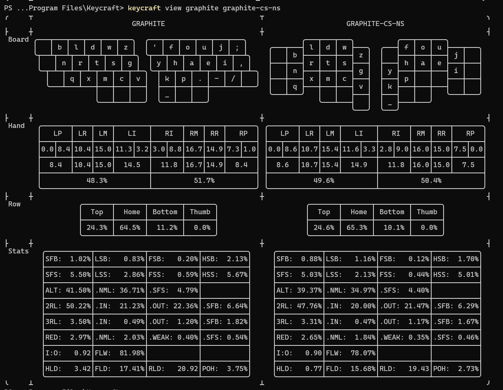
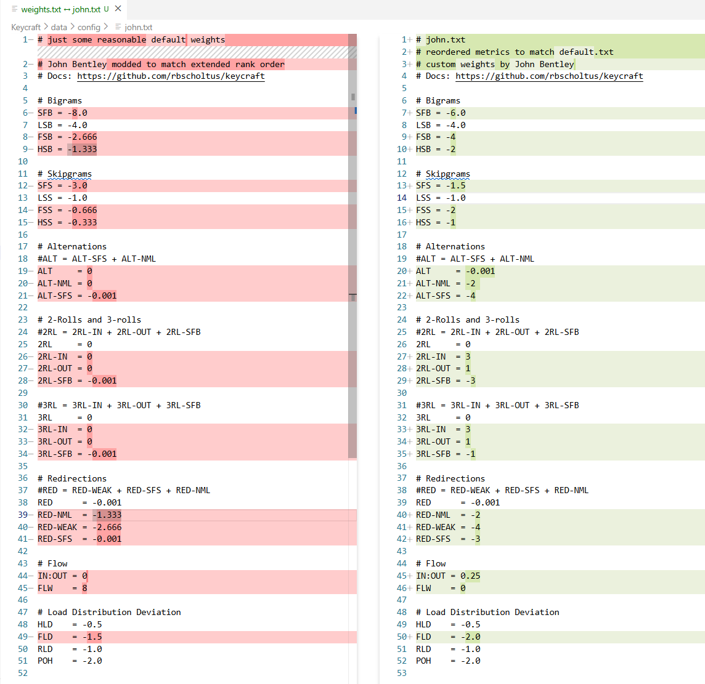

# What are the best midish-to-lowish Alt + highish Roll + other idiosyncratic criteria layouts?

Under construction ...

## Intro

What are the best midish-to-lowish Alt + highish Roll + other idiosyncratic criteria layouts?

The other idiosyncratic criteria include:

* Colstag layout. As colstag is an improvement on rowstag (and so I'm on a ZSA Voyager).
* Excluding thumb alpha layouts. To keep the thumb keys for other things like backspace, tab, enter, space.
* Must have bottom row symbol slots on at least ring and middle fingers. Because I'm set in my qwerty ways for "," and "." (but allow this could be on the left hand).
* No magic key. As this would make the layout advanced (for me).
* No repeat key. As I don't think I'd prefer this over just tapping the relevant key twice. 

## TL;DR:

On my analysis, and answering my own question, the winning layouts are:

* **ints-cs-ns** by Tanamar. A "3roll" layout.
* **wave2-cs-ns** by eco. A "Highish Roll; midish redirect (STRD/SRTD/SRTC)" layout.

Runner up:

* sturdy-cs-ns by Oxey. Highish Roll; lowish redirect (STRD/SRTD/SRTC)

"cs" is my abbreviation for "colstag", a column staggered keyboard.

"ns" is my abbreviation for "no symbols". That is, symbols where removed from the layout before that part of my analysis that used the analyser keycraft.

## Context

This is a follow up post to my [Regard for inrolly2](https://discord.com/channels/807843650717483049/1439184823615885332/1439184823615885332) which turned into a thread with good feedback on good alt layouts in general.

I'll repeat my situation as I mentioned it there (with a different emphasis and some addition here):

* I'm a new alt layout user.
* I've learnt Graphite to about 20wpm on my ZSA Voyager, a colstag (split) keyboard.
* I've read @ec0's [Keyboard layouts doc (3rd edition)](https://docs.google.com/document/d/1W0jhfqJI2ueJ2FNseR4YAFpNfsUM-_FlREHbpNGmC2o/edit?tab=t.2yb5bwiy1wa8#heading=h.rwlzs0nuaefi) (KLD)  ...
* I've skimmed https://layouts.wiki/. In particular, https://layouts.wiki/guides/start/recommendations/
* I had come to suspect I dislike highish Alternation and like high Rolls, especially 3rolls. Something Graphite lacks. That suspicion has been deepened from my analysis.

## Analysis - overview

"My analysis" here means:

1. Taking a long list of candidate layouts to evaluate. Largely those flagged by anyone in "Regard for inrolly2" as worthy. This came to 13 layouts. In addition I keep around graphite and qwerty as reference layouts. So 15 layouts in total to compare.
2. My use of @ironcollar's excellent analyser [keycraft](https://github.com/rbscholtus/keycraft); 
3. Dumping data from keycraft into Excel and applying @ec0's ranking bands: A 9 rung English word "Min, Very low, Low, Mid low, Mid, Mid high, High, Very high, Max" with sets of three of each banded into red, yellow, and green (depending on whether we want, for a metric, a minimum or a maximum).
4. Bringing to bear insights from KLD; and
5. Bringing to bear insights from AKL veterans in "Regard for inrolly2". 

(4) and (5) have been useful to identify either: 
* Patterns that aren't revealed in, or aren't obvious in, the keycraft or Excel output; and/or
* Patterns bourne out by the experience of veterans in their use of layouts.

"My analysis" is ahead of trialling the winning layouts myself. In "Regard for inrolly2" some mentioned the helpful https://keyboard-layout-try-out.pages.dev/, as a quick way to do a software-based trial of layouts. Because you use qwerty to emulate how a different layout would feel. However, in my having learnt Graphite (even to a low WPM) my qwerty usage is somewhat borked. So I'm intending to trial the winning layouts - ints and wave2 - at the hardware level on my Voyager (which is easy to do with that keyboard). I have in mind I'll learn each layout to 20 wpm - ints first, then wave2 - and decide on the ultimate winner at that point.

Incidentally, that my qwerty usage is borked flags to me I may want to practice both a candidate/winning alt layout and qwerty at the same time. That is, to remain bi-layout competent. For I'll want to retain the ability to jump on qwerty for brief spouts of: 

* Standard laptop usage (custom colstag keyboards and laptops are still a way off)
* Mobile phone (software) keyboards 
* Gaming. Gaming layouts are probably necessarily stuck with qwerty as a reference. I don't think it would be practical to remap a game's keyboard commands to a non qwerty layout. I intend to retain a separate traditional qwerty rowstag keyboard for gaming. (I have and endorse a Keychron K1 Pro)

Anyway the point of my analysis has been to identify one or two layouts that will be worthy of trial.

## Analysis - ways of speaking

I'll demo keycraft commands as I use them on Windows and Powershell. Which should remain obvious on how to use on different platforms (keycraft itself is multiplatform).

"cs" is my abbreviation for "colstag", a column staggered keyboard.

"ns" is my abbreviation for "no symbols". That is, symbols where removed from the layout before that part of my analysis that used the analyser keycraft.

I'll refer to a [keycraft metric](https://github.com/rbscholtus/keycraft?tab=readme-ov-file#supported-metrics) as defined in the linked readme, usually by using the acronym ("SFB", "3RL-IN", etc). @ironcollar has recently updated that readme (and added a few more metrics, and altered a few metric names) to be far clearer.

Note from keycraft > Supported Metrics (previously linked) "Bigram, skipgram, and trigram metrics follow the Keyboard Layouts Doc".

When I refer to metric **value** I'll either:

* If using ec0's 9 rung English word "Min, Very low, Low, Mid low, Mid, Mid high, High, Very high, Max" - I'll use that word. E.g. I might say "wave2-cs-ns has a **very high** FSB"; or
* Speak broadly to refer to the 3 rung band (within which there is the further division into three). To do this I'll use "Lowish", "Midish", or "Highish". E.g. I might say "wave2-cs-ns has a **highish** FSB".

## Analysis - keycraft customisation

### Layout customisation

After installing keycraft (v0.5.0) I copy and modify the 15 layouts of interest.

From example data\layouts\graphite.klf ...

```
# https://github.com/rdavison/graphite-layout
rowstag
~ b l d w z  ' f o u j ;
~ n r t s g  y h a e i ,
~ q x m c v  k p . - / ~
      ~ ~ ~  _ ~ ~
```

... is copied as data\layouts\graphite-cs-ns.klf ...

```
# https://github.com/rdavison/graphite-layout
colstag
~ b l d w z  ~ f o u j ~
~ n r t s g  y h a e i ~
~ q x m c v  k p ~ ~ ~ ~
      ~ ~ ~  _ ~ ~
```

I've changed to "rowstag" keyword to "colstag". And I've blanked out the symbols.

Evidently in keycraft both matter. E.g. `keycraft view graphite graphite-cs-ns` will produce differences in layout presentation and calculation (@ironcollar could say more).



### Weights file customisation

The keycraft `rank` commands allows one to use a custom weights file. My weights file is on the right ...



In summary, compared to the default, I penalise higher ALTs and promote 2RL-IN and 3RL-INs.

My weights file differences are more shooting from the hip rather than being the result of some careful or deep meditation on the numbers. It's easy to change the rank order of layouts through small tweaks in the weights file. So the weights file is intended to produce a rank that situates us roughly; then from there looking more closely at the metric scores for each layout. In other words I'm open to, as a notion before the start of analysis proper, disqualifying a layout that scores better than a layout I may keep.

### Corpus

keycraft comes with three corpora. And a robot (ChatCPT) tells me, in summary:

* shai. Optimised for: "Real English". Used it when: writing, daily use.
* monkeyracer. Optimised for: "Speed tests". Used it when: typing races.
* akl. Optimised for: "Code & symbols". Used it when: programming-heavy work.

I can't find links to anything authoritative that details how these corpora where derived.

```powershell
Clear
Set-Location "C:\Program Files\Keycraft"
$LongList = @("flour-colstag-ns","flame-cs-ns","gallium-v2-cs-ns","graphite-cs-ns","heyyou-cs-ns","hieamtsrn-cs-ns","inrolly2-cs-ns","ints-cs-ns","rain-cs-ns-cmini","seht-drai-cs-ns","sturde-cs-ns","sturdy-cs-ns","trendy-cs-ns","wave2-cs-ns","qwerty-ns")
keycraft rank $LongList --weights-file john.txt --metrics extended --deltas graphite-cs-ns --corpus shai.txt
```
